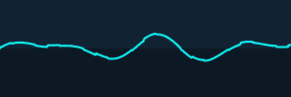

<h1>
x-oscilloscope <a href="https://npmjs.org/package/x-oscilloscope"></a> <a href="src"></a> <a href="https://cdn.jsdelivr.net/npm/x-oscilloscope@1.0.0/dist/x-oscilloscope.min.js"></a> <a href="LICENSE"></a>
</h1>

<p></p>

Audio oscilloscope visualizer Web Component

<h4>
<table><tr><td title="Triple click to select and copy paste">
<code>npm i x-oscilloscope </code>
</td><td title="Triple click to select and copy paste">
<code>pnpm add x-oscilloscope </code>
</td><td title="Triple click to select and copy paste">
<code>yarn add x-oscilloscope</code>
</td></tr></table>
</h4>

## Examples

<details id="example$web" title="web" open><summary><span><a href="#example$web">#</a></span>  <code><strong>web</strong></code></summary>  <ul><p></p>  <a href="https://stagas.github.io/x-oscilloscope/example/web.html"></img>  <p><strong>Try it live</strong></p></a>    <details id="source$web" title="web source code" ><summary><span><a href="#source$web">#</a></span>  <code><strong>view source</strong></code></summary>  <a href="example/web.ts">example/web.ts</a>  <p>

```ts
import { fetchAudioBuffer } from 'webaudio-tools'
import { OscilloscopeElement } from 'x-oscilloscope'

customElements.define('x-oscilloscope', OscilloscopeElement)
document.body.innerHTML = `
<div id="demo" style="display:inline-flex;height:80px;">
  <x-oscilloscope autoresize></x-oscilloscope>
</div>
`

const ctx = new AudioContext({ sampleRate: 44100, latencyHint: 'playback' })

const analyser = ctx.createAnalyser()
analyser.fftSize = 2048
analyser.smoothingTimeConstant = 0
analyser.maxDecibels = 0
analyser.minDecibels = -100

// @ts-ignore
const url = new URL('alpha_molecule.ogg', import.meta.url).toString()

fetchAudioBuffer(ctx, url).then(audioBuffer => {
  const source = ctx.createBufferSource()
  source.buffer = audioBuffer
  source.loop = true
  source.connect(ctx.destination)
  source.start(0, 83)
  source.connect(analyser)
  ;(document.querySelector('x-oscilloscope') as OscilloscopeElement).analyser =
    analyser
})

window.onclick = () => ctx.state !== 'running' ? ctx.resume() : ctx.suspend()
if (ctx.state !== 'running')
  document.body.appendChild(new Text('click to start/stop'))
// requestAnimationFrame <- for shoty
```

</p>
</details></ul></details>

## API

<p>  <details id="OscilloscopeElement$1" title="Class" open><summary><span><a href="#OscilloscopeElement$1">#</a></span>  <code><strong>OscilloscopeElement</strong></code>    </summary>  <a href="src/x-oscilloscope.tsx#L7">src/x-oscilloscope.tsx#L7</a>  <ul>        <p>  <details id="constructor$3" title="Constructor" ><summary><span><a href="#constructor$3">#</a></span>  <code><strong>constructor</strong></code><em>()</em>    </summary>    <ul>    <p>  <details id="new OscilloscopeElement$4" title="ConstructorSignature" ><summary><span><a href="#new OscilloscopeElement$4">#</a></span>  <code><strong>new OscilloscopeElement</strong></code><em>()</em>    </summary>    <ul><p><a href="#OscilloscopeElement$1">OscilloscopeElement</a></p>        </ul></details></p>    </ul></details><details id="analyser$10" title="Property" ><summary><span><a href="#analyser$10">#</a></span>  <code><strong>analyser</strong></code>    </summary>  <a href="src/x-oscilloscope.tsx#L21">src/x-oscilloscope.tsx#L21</a>  <ul><p><span>AnalyserNode</span></p>        </ul></details><details id="autoResize$5" title="Property" ><summary><span><a href="#autoResize$5">#</a></span>  <code><strong>autoResize</strong></code>  <span><span>&nbsp;=&nbsp;</span>  <code>true</code></span>  </summary>  <a href="src/x-oscilloscope.tsx#L12">src/x-oscilloscope.tsx#L12</a>  <ul><p>boolean</p>        </ul></details><details id="background$8" title="Property" ><summary><span><a href="#background$8">#</a></span>  <code><strong>background</strong></code>  <span><span>&nbsp;=&nbsp;</span>  <code>'#123'</code></span>  </summary>  <a href="src/x-oscilloscope.tsx#L15">src/x-oscilloscope.tsx#L15</a>  <ul><p>string</p>        </ul></details><details id="color$9" title="Property" ><summary><span><a href="#color$9">#</a></span>  <code><strong>color</strong></code>  <span><span>&nbsp;=&nbsp;</span>  <code>'#1ff'</code></span>  </summary>  <a href="src/x-oscilloscope.tsx#L16">src/x-oscilloscope.tsx#L16</a>  <ul><p>string</p>        </ul></details><details id="height$7" title="Property" ><summary><span><a href="#height$7">#</a></span>  <code><strong>height</strong></code>  <span><span>&nbsp;=&nbsp;</span>  <code>50</code></span>  </summary>  <a href="src/x-oscilloscope.tsx#L14">src/x-oscilloscope.tsx#L14</a>  <ul><p>number</p>        </ul></details><details id="width$6" title="Property" ><summary><span><a href="#width$6">#</a></span>  <code><strong>width</strong></code>  <span><span>&nbsp;=&nbsp;</span>  <code>150</code></span>  </summary>  <a href="src/x-oscilloscope.tsx#L13">src/x-oscilloscope.tsx#L13</a>  <ul><p>number</p>        </ul></details><details id="start$24" title="Method" ><summary><span><a href="#start$24">#</a></span>  <code><strong>start</strong></code><em>()</em>     &ndash; Start displaying the spectrum.</summary>  <a href="src/x-oscilloscope.tsx#L40">src/x-oscilloscope.tsx#L40</a>  <ul>    <p>      <p><strong>start</strong><em>()</em>  &nbsp;=&gt;  <ul>void</ul></p></p>    </ul></details><details id="stop$26" title="Method" ><summary><span><a href="#stop$26">#</a></span>  <code><strong>stop</strong></code><em>()</em>     &ndash; Stop displaying the spectrum.</summary>  <a href="src/x-oscilloscope.tsx#L46">src/x-oscilloscope.tsx#L46</a>  <ul>    <p>      <p><strong>stop</strong><em>()</em>  &nbsp;=&gt;  <ul>void</ul></p></p>    </ul></details></p></ul></details></p>

## Credits

- [mixter](https://npmjs.org/package/mixter) by [stagas](https://github.com/stagas) &ndash; A Web Components framework.
- [x-plot](https://npmjs.org/package/x-plot) by [stagas](https://github.com/stagas) &ndash; A Web Component that plots zoomable and pannable waveforms.

## Contributing

[Fork](https://github.com/stagas/x-oscilloscope/fork) or [edit](https://github.dev/stagas/x-oscilloscope) and submit a PR.

All contributions are welcome!

## License

<a href="LICENSE">MIT</a> &copy; 2022 [stagas](https://github.com/stagas)
